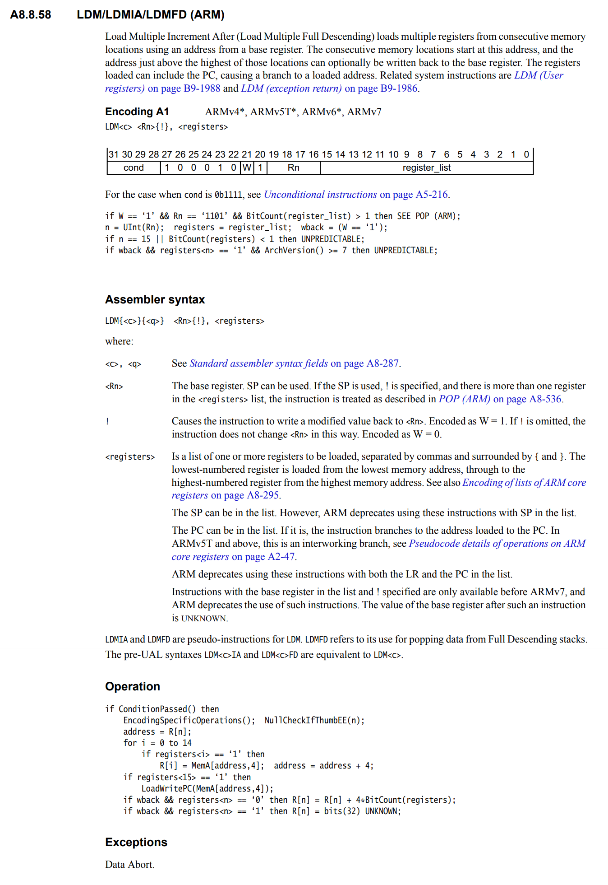
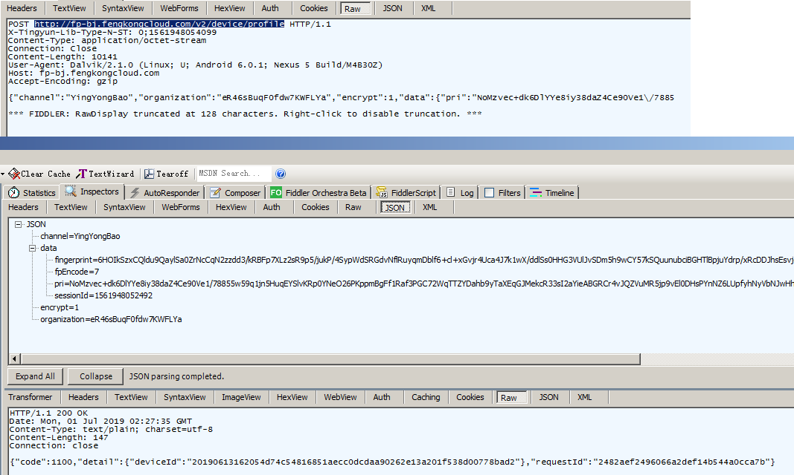
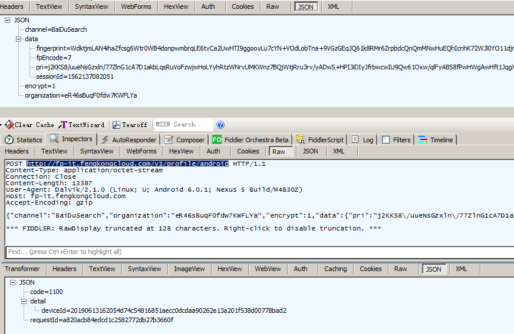
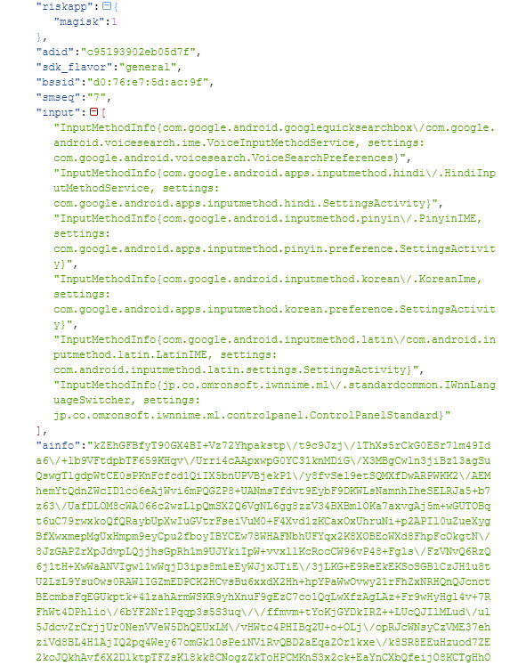
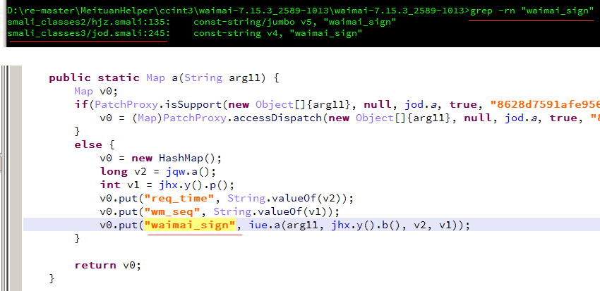
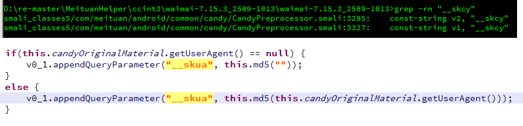

# MakeThings

[TOC]


两数相比：

1. 数轴比较法：左侧的数大于右侧的数；零点左边越左越大；零点右边越右越大；
2. 绝对值比较：同正数时，绝对值越大，值越大；负数的绝对值越大，值越小；


## ARM

参考手册：

`ARM®Architecture Reference Manual - ARMv7-A and ARMv7-R edition`

`ARM DDI 0406C.c (ID051414)`

### 	ARM 核心寄存器

参考章节：`A2.3 ARM core registers`

在应用程序级中可见的ARM处理器有：

13个通用32位寄存器：`R0`~`R12`

3个特殊用途的32位寄存器：`SP`，`LR`和`PC`，可以描述为`R13`，`R14`和`R15`

### LDMFD

ARM指令集：



IDA中显示如下指令：

```assembly
03 C0 BD E8                 LDMFD           SP!, {R0,R1,LR,PC}
```

该指令的字节码：`0xE8BDC003`

转为二进制并拆分指令：`0b1110 100010 1 1 1101 1100000000000011`

`cond`：`1110`

`100010`

`W`：`1`

`1`

`Rn`：`1101`

`register_list`：`1100000000000011`


## grep

`-n` 显示行号并高亮匹配

`-i` 忽略大小写

`-r` 递归方式搜索所有文件

`--include=FILE_PATTERN` 只搜索匹配到`FILE_PATTERN`的文件；

`FILE_PATTERN` *.{smali,xml} 或 *.smali


## IDAPython


## Jeb Python


## Frida

### 获取 `Java` 基础数据类型的 `Class`；例如: `int.class`

在 `Java` 中，基础数据类型的 `Class` 与其包装类的 `TYPE` 字段等价；例如：

```java
System.out.println("Test boolean: " + (boolean.class == java.lang.Boolean.TYPE));
System.out.println("Test Boolean: " + (boolean.class == java.lang.Boolean.class));
```

控制台输出：

```
Test boolean: true
Test Boolean: false
```


好用的Frida脚本，使用时请删除脚本中的中文字符，Frida的js解释器不支持中文：

```javascript
const gettid = new NativeFunction(Module.findExportByName(null, "gettid"), "uint32", []);
const getpid = new NativeFunction(Module.findExportByName(null, "getpid"), "uint32", []);

function JThreadTrace2String(thread, tabsize) {
  var tab_str = "";
  var ret;
  for (var i = 0; i < tabsize; i++) {
    tab_str += "  ";
  }
  ret = tab_str + "Thread Stack Trace -> id:[" + gettid() + "], name:[" + thread.getName() + "]\n";
  ret += tab_str + "  " + thread.getStackTrace().join("\n" + tab_str + "  ");
  return ret;
}

const JNIEnv = NULL;
const JNIEnvPtr = NULL;
const JNIEnvVftablePtr = NULL;
const RegisterNatives = NULL;
const GetStringUTFChars = NULL;

var jBoolean;
var jCharacter;
var jByte;
var jShort;
var jInteger;
var jLong;
var jFloat;
var jDouble;

var jAccessibleObject;
var jArray;
var jField;
var jMethod;

var jThread;
var jString;
var jClass;
var jCharSequence;

var jFile;
var jFileOutputStream;

var jHashMap;
var jSet;
var jIterator;
var jZipOutputStream;

var jURLEncoder;

var jContext;
var jApplication;
var jLog;
var jBase64;
var jCursor;
var jCursorAdapter;
var jView;
var jLayoutInflater;

Java.perform(function () {
  // JavaScript wrapper Of Java Primitive Classes.
  jBoolean = Java.use("java.lang.Boolean");
  jCharacter = Java.use("java.lang.Character");
  jByte = Java.use("java.lang.Byte");
  jShort = Java.use("java.lang.Short");
  jInteger = Java.use("java.lang.Integer");
  jLong = Java.use("java.lang.Long");
  jFloat = Java.use("java.lang.Float");
  jDouble = Java.use("java.lang.Double");

  // JavaScript wrapper Of Java Reflection.
  jAccessibleObject = Java.use("java.lang.reflect.AccessibleObject");
  jArray = Java.use("java.lang.reflect.Array");
  jField = Java.use("java.lang.reflect.Field");
  jMethod = Java.use("java.lang.reflect.Method");

  jThread = Java.use("java.lang.Thread");
  jString = Java.use("java.lang.String");
  jClass = Java.use("java.lang.Class");
  jCharSequence = Java.use("java.lang.CharSequence");

  jFile = Java.use("java.io.File");
  jFileOutputStream = Java.use("java.io.FileOutputStream");

  jHashMap = Java.use("java.util.HashMap");
  jSet = Java.use("java.util.Set");
  jIterator = Java.use("java.util.Iterator");
  jZipOutputStream = Java.use("java.util.zip.ZipOutputStream");

  jURLEncoder = Java.use("java.net.URLEncoder");

  jContext = Java.use("android.content.Context");
  jApplication = Java.use("android.app.Application");
  jCursor = Java.use("android.database.Cursor");
  jCursorAdapter = Java.use("android.widget.CursorAdapter");

  jLayoutInflater = Java.use("android.view.LayoutInflater");
  jView = Java.use("android.view.View");
  jLog = Java.use("android.util.Log");
  jBase64 = Java.use("android.util.Base64");
});

Java.perform(function () {
  const nativeHook_RegisterNatives = {
    onEnter: function (args) {
      this.tag = "libart.RegisterNatives";
      this.log = "";
      const tid = gettid();
      this.env = args[0];
      this.clazz = args[1];
      this.methods = args[2];
      this.nMethods = parseInt(args[3]);

      this.log += "> - - - - tid:[" + tid + "] - - - - <\n";
      this.log += this.tag + " Enter.\n";
      this.log += "  env: " + this.env + "\n";
      this.log += "  clazz: " + Java.vm.getEnv().getClassName(this.clazz) + "\n";
      this.log += "  methods: " + this.methods + "\n";
      this.log += "  nMethods: " + this.nMethods + "\n";
      for (var i = 0; i < this.nMethods; i++) {
        const methodName = this.methods.add(i * (Process.pointerSize * 3)).readPointer().readCString();
        const methodSig = this.methods.add(i * (Process.pointerSize * 3) + (Process.pointerSize * 1)).readPointer().readCString();
        const methodPtr = this.methods.add(i * (Process.pointerSize * 3) + (Process.pointerSize * 2)).readPointer();
        const methodMod = Process.findModuleByAddress(methodPtr);
        this.log += "    " + (i + 1) + ":\n";
        this.log += "      methodName: " + methodName + "\n";
        this.log += "      methodSig: " + methodSig + "\n";
        this.log += "      methodPtr: " + methodPtr + ", off: " + methodPtr.sub(methodMod.base) + "\n";
        this.log += "      methodLib: " + methodMod.name + ", base: " + methodMod.base + "\n";
        this.log += "\n";
        // 可以在这里Hook那些被动态注册的函数
        //if (methodName === "_8a593c5e38dc0a884508b96483e3292c17") {
        //  Interceptor.attach(methodPtr, nativeHook_8a593c5e38dc0a884508b96483e3292c17);
        //} else if (methodName === "_4d13d8b0bdcec28da0dd04f51a23c83f7") {
        //  Interceptor.attach(methodPtr, nativeHook_4d13d8b0bdcec28da0dd04f51a23c83f7);
        //} else if (methodName === '_91151e728fa0ffa08ae6d7c21b4246fc6') {
        //  Interceptor.attach(methodPtr, nativeHook_91151e728fa0ffa08ae6d7c21b4246fc6);
        //}
      }
      // 打开这里的日志可以看到所有被动态注册的函数
      //console.log(this.log);
    },
    onLeave: function (ret) {
      this.log = "";
      const tid = gettid();
      this.log += this.tag + " Leave.\n";
      this.log += "  ret: " + ret + "\n";
      this.log += "^ - - - - tid:[" + tid + "] - - - - ^\n";
      // 打开这里的日志可以看到所有被动态注册的函数
      //console.log(this.log);
    }
  };
  JNIEnv = Java.vm.getEnv();
  JNIEnvPtr = JNIEnv.handle;
  JNIEnvVftablePtr = JNIEnvPtr.readPointer();
  RegisterNatives = new NativeFunction(JNIEnvVftablePtr.add(215 * Process.pointerSize).readPointer(),
    'pointer', ['pointer', 'pointer', 'pointer', 'int']);
  GetStringUTFChars = new NativeFunction(JNIEnvVftablePtr.add(169 * Process.pointerSize).readPointer(),
    'pointer', ['pointer', 'pointer', 'pointer']);
  Interceptor.attach(RegisterNatives, nativeHook_RegisterNatives);

  const log = "";
  log += "pid: " + getpid() + "\n";
  log += "tid: " + gettid() + "\n";
  log += "JNIEnvPtr: " + JNIEnvPtr + "\n";
  log += "JNIEnvVftablePtr: " + JNIEnvVftablePtr + "\n";
  console.log(log);
});
```


## LLDB

列出可用的平台插件

```
(lldb) platform list
```

选择一个可用的平台插件

```
(lldb) platform select remote-android
```

连接到指定设备名称的指定端口上，该端口一定是lldb-server所监听的端口

```
(lldb) platform connect connect://0dfa1ebb43e6f28d:12345
```

设置lldb的工作目录

```
(lldb) platform settings -w /data/local/tmp
```

查看当前平台的状态：平台插件；系统架构；内核版本；主机名称；连接是否正常；工作目录

```
(lldb) platform status
```

指定一个对应平台的可执行文件的绝对路径，将上传这个可执行文件到工作目录中，接下来将会调试启动它。

```
(lldb) file "D:\TestSignal\app\src\main\cpp\signal_test"
```

指定一个断点，位于_start的第一行代码

```
(lldb) b _start
```


## Android

### CERT.RSA 转 PEM

```bash
openssl pkcs7 -in cert.RSA -inform DER -print_certs -out cert.pem
```


向进程发送信号

```c
kill()
raise(int signum)
```

SIGTRAP 信号的默认处理函数

```
linker/debugger.cpp debuggerd_signal_handler
linker.__dl__ZL24debuggerd_signal_handleriP7siginfoPv
```

### adbd 网络模式

```bash
setprop service.adb.tcp.port 5555
stop adbd
start adbd
```

### Native

静态注册或动态注册的Native函数，第二个参数总是一个`jobject`，标识了调用者的信息；例如：

```java
private native String TestNative(int arg1, int arg2, String arg3);
```

在frida hook时：

```javascript
const nativeHook_TestNative = {
  onEnter: function (args) {
    this.env = args[0];
    //this.caller = args[1]; // jobject of the caller.
    this.arg1 = args[2];
    this.arg2 = args[3];
    this.arg3 = args[4];
    this.tag = "nativeHook_TestNative";
    this.log = "";
    const tid = gettid();
    this.log += "> - - - - tid:[" + tid + "] - - - - <\n";
    this.log += this.tag + " Enter.\n";
    this.log += "  env: " + this.env + "\n";
    this.log += "  arg1: " + this.arg1 + "\n";
    this.log += "  arg2: " + this.arg2 + "\n";
    this.log += "  arg3: " + this.arg3 + ", " + GetStringUTFChars(this.env, this.arg3, NULL).readCString() + "\n";
    console.log(this.log);
  },
  onLeave: function (ret) {
    const tid = gettid();
    this.log = this.tag + " Leave.\n";
    this.log += "  ret: " + ret + ", str:" + GetStringUTFChars(this.env, ret, NULL).readCString() + "\n";
    this.log += "^ - - - - tid:[" + tid + "] - - - - ^\n";
    console.log(this.log);
  }
};
```


## Batch

### 调试启动APK

```bat
:: Example:
::   run_dbg.bat org.github.testsignal .MainActivity
@ECHO OFF
CALL :DeQuote %1
SET PACKAGE_NAME=%return%

CALL :DeQuote %2
SET ACTIVITY_NAME=%return%

adb shell am start -D %PACKAGE_NAME%/%ACTIVITY_NAME%
adb shell ps | findstr %PACKAGE_NAME%
ECHO please input process id:
SET /P PID=
adb forward tcp:12346 jdwp:%PID%
jdb -connect com.sun.jdi.SocketAttach:port=12346

PAUSE
GOTO :EOF

:DeQuote
  SET return=%~1
  GOTO :EOF
```


## 常用加解密和HASH算法

### UnPadding

```python
def unpadding(data: bytes):
    padding = data[len(data) - 1]
    return data[: len(data) - padding]
```

### PKCS5Padding和PKCS7Padding

在PKCS5Padding中，明确定义Block的大小是8位，而在PKCS7Padding定义中，对于块的大小是不确定的，可以在1-0xFF之间；填充值的算法都是一样的。

```python
def pkcs5_padding(data: bytes, block_size: int):
    padding = block_size - len(data) % block_size
    return data + (chr(padding) * padding).encode()
```

### ZeroPadding

```python
def zero_padding(data: bytes, block_size: int):
    padding = block_size - len(data) % block_size
    return data + ('\x00' * (padding - 1)).encode() + chr(padding).encode()
```

### DES


## OLLVM

### add

1. `(x ^ y) + 2 * (x & y)` `可转化为` `x + y`：

   - 推导1：设`y != 0 且 x & y = y`

     `(x ^ y)` `转化为` `(x - y)`

     `2 * (x & y)` `转化为` `2y`

     `(x - y) + 2y` `转化为` `x + y`

     

   - 推导2：设`y = 0`

     `(x ^ y)` `转化为` `(x + y)`

     `2 * (x & y)` `转化为` `0`

     `(x + y) + 0` `转化为` `x + y`
     
     

2. `2 * (x | y) - (x ^ y)` `可转化为` `x + y`：

   - 推导1：设`y = 1 且 x & y = 1`，得`2 * (x | 1) - (x ^ 1)`

     表达式1：`2 * (x | 1)` `转化为` `2x`

     表达式2：`(x ^ 1)` `转化为` `(x - 1)`

     结果：`2x - (x - 1)` `转化为`  `2x - x + 1` `转化为` `x + 1`

   - 推导2：设`y = 0`，得`2 * (x | 0) - (x ^ 0)`

     表达式1：`2 * (x | y)` `转化为` `2x`

     表达式2：`(x ^ y)` `转化为` `x`

     结果：`2x - x` `转化为` `x`

 


## 小红书

### Shumei Profile

`http://fp-bj.fengkongcloud.com/v2/device/profile`




`http://fp-it.fengkongcloud.com/v3/profile/android `



`organization`： 公司信息；数美给每个公司的唯一标识；写死在代码中；

`fingerprint`： 一段JSON数据被加密后的内容；加密方式如下：

1. 对一个随机生成16的个字符的串做MD5Hash；
2. 将MD5作为Key进行`AES_CBC_256bits_PKCS5Padding`加密；

`pri`： 上一步中生成的16个字符的随机串；`RSA/ECB/PKCS1Padding`用公钥加密后再进行BASE64编码；

因为使用了`RSA`非对称加解密算法，所以该字段需要私钥才能解密；要解密`fingerprint`字段就需要在加密前获取到`key`才行；

加密前的`fingerprint`预览：



可以从上图中看到`fingerprint`字段中还有`ainfo`是被加密的；

`ainfo`加密方式如下：

1. 计算`smsdkshumeiorganizationflag`的MD5Digest`51996e9be805c9284e69bc7684800a26`；
2. 以`51996e9be805c9284e69bc7684800a26`作`key`；`0102030405060708`作`IV`；进行`AES_CBC_256bits_PKCS5Padding`加密；
3. 最后以Base64对加密结果进行编码；

`ccmd5`：`CloudConfiguretion`计算MD5Digest

`ainfo["ds_md5"]`：`/data/system`

`ainfo["ds_md52"]`：`/data/system`

`ainfo["sb_md5"]`：`/system/bin`

`ainfo["sf_md5"]`：`/system/framework`

`ainfo["vl_md5"]`：`/vendor/lib`

`ainfo["vf_md5"]`：`/vendor/firmware`

`fingerprint["net"]`：网卡信息

`fingerprint["smid"]`: 当`idType`为`'00'`时由服务器返回一个`idType`为`'01'`的新`smid`

`fingerprint["ainfo"]["sys_props"]["ro.serialno"]`


## 美团

- `waimai_sign`字段溯源：

1. 字符串引用定位到`jod.smali`：




2. `iue.a`方法解析：

`参数1`：url；例如：`/api/v7/poi/channelpage`

`参数2`：android Device Id 或 随机UUID

`参数3`：时间戳

`参数4`：序列，可能用来表示APP被使用的次数；它是一个递减的值；可能递减到0时，将提示登录；

分析发现函数内部采用`RSA/ECB/PKCS1Padding`；该算法将导致同一输入，每次加密的结果不一致；

通过修改`javax.crypto.Cipher.getInstance`函数将加密算法替换为`RSA/ECB/NoPadding`；`NoPadding`可以保证同一输入，每次的加密结果都是一致的；这样就可以验证加密结果是否正确；在`NoPadding`的结果一致时，再将`NoPadding`替换为`PKCS1Padding`；以确保还原的算法是100%正确的。


- `__skua`字段溯源：

1. 字符串引用定位到`CandyPreprocessor.smali`：

空字符串的md5digest或`User-Agent`的md5digest




- `__skno`：随机UUID

## GO

```go
h := map[string]interface{}{
  "name":   "Bob",
  "age":    21,
  "height": 1.75,
  "far":    [...]string{"rap", "jmp", "bu"},
  "ever": map[string]interface{}{
    "a": "1",
    "b": 2,
    "c": byte(3),
    "d": float32(4),
    "e": float64(5),
  },
}
j, _ := json.Marshal(h) // 对象转 []byte
fmt.Println(string(j))  // []byte 转 string

var f map[string]interface{}
_ = json.Unmarshal(j, &f) // []byte 转 对象，这里的对象是 map[string]interface{}
fmt.Println(f["name"])
```

```go
{"age":21,"ever":{"a":"1","b":2,"c":3,"d":4,"e":5},"far":["rap","jmp","bu"],"height":1.75,"name":"Bob"}
Bob

```

