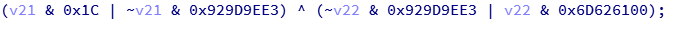
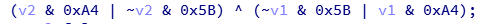

# MakeThings

[TOC]


两数相比：

1. 数轴比较法：左侧的数大于右侧的数；零点左边越左越大；零点右边越右越大；
2. 绝对值比较：同正数时，绝对值越大，值越大；负数的绝对值越大，值越小；


## ARM

参考手册：

`ARM®Architecture Reference Manual - ARMv7-A and ARMv7-R edition`

`ARM DDI 0406C.c (ID051414)`

### 	ARM 核心寄存器

参考章节：`A2.3 ARM core registers`

在应用程序级中可见的ARM处理器有：

13个通用32位寄存器：`R0`~`R12`

3个特殊用途的32位寄存器：`SP`，`LR`和`PC`，可以描述为`R13`，`R14`和`R15`

### `LDMFD`

ARM指令集：


IDA中显示如下指令：

```assembly
03 C0 BD E8                 LDMFD           SP!, {R0,R1,LR,PC}
```

该指令的字节码：`0xE8BDC003`

转为二进制并拆分指令：`0b1110 100010 1 1 1101 1100000000000011`

`cond`：`1110`

`100010`

`W`：`1`

`1`

`Rn`：`1101`

`register_list`：`1100000000000011`


## grep

`-n` 显示行号并高亮匹配

`-i` 忽略大小写

`-r` 递归方式搜索所有文件

`--include=FILE_PATTERN` 只搜索匹配到`FILE_PATTERN`的文件；

`FILE_PATTERN` *.{smali,xml} 或 *.smali


## IDAPython


## Jeb Python


## Frida

### 获取 `Java` 基础数据类型的 `Class`；例如: `int.class`

在 `Java` 中，基础数据类型的 `Class` 与其包装类的 `TYPE` 字段等价；

Java 示例：

```java
System.out.println("Test boolean: " + (boolean.class == java.lang.Boolean.TYPE));
System.out.println("Test Boolean: " + (boolean.class == java.lang.Boolean.class));
```

控制台输出：

```
Test boolean: true
Test Boolean: false
```


Frida 示例：在 `Frida` 中通过反射获取 `java.util.List.get` 方法

```JavaScript
Java.perform(function() {
  var IntegerClz = Java.use("java.lang.Integer")["class"];
  var ListClz = Java.use("java.util.List")["class"];
  var Integer$TYPE = IntegerClz.getDeclaredField("TYPE").get(null);

  // 因为 Integer$TYPE 在 Frida 中的数据类型是 `Ljava.lang.Object;`
  // 这将导致 Frida 无法自动重载 `[Ljava.lang.Class;`
  // 所以这里需要 overload().call() 强制调用；
  var ListGetMethod = ListClz.getDeclaredMethod
      .overload('java.lang.String', '[Ljava.lang.Class;')
      .call(ListClz, "get", [Integer$TYPE]);
  console.log(ListGetMethod);
});
```

Frida输出：

```java
public abstract java.lang.Object java.util.List.get(int)
```


## LLDB

列出可用的平台插件

```
(lldb) platform list
```

选择一个可用的平台插件

```
(lldb) platform select remote-android
```

连接到指定设备名称的指定端口上，该端口一定是lldb-server所监听的端口

```
(lldb) platform connect connect://0dfa1ebb43e6f28d:12345
```

设置lldb的工作目录

```
(lldb) platform settings -w /data/local/tmp
```

查看当前平台的状态：平台插件；系统架构；内核版本；主机名称；连接是否正常；工作目录

```
(lldb) platform status
```

指定一个对应平台的可执行文件的绝对路径，将上传这个可执行文件到工作目录中，接下来将会调试启动它。

```
(lldb) file "D:\TestSignal\app\src\main\cpp\signal_test"
```

指定一个断点，位于_start的第一行代码

```
(lldb) b _start
```


## Android

### CERT.RSA 转 PEM

```bash
openssl pkcs7 -in cert.RSA -inform DER -print_certs -out cert.pem
```


向进程发送信号

```c
kill()
raise(int signum)
```

SIGTRAP 信号的默认处理函数

```
linker/debugger.cpp debuggerd_signal_handler
linker.__dl__ZL24debuggerd_signal_handleriP7siginfoPv
```

### adbd 网络模式

```bash
setprop service.adb.tcp.port 5555
stop adbd
start adbd
```

### Native

对于Native函数

## Batch

### 调试启动APK

```bat
:: Example:
::   run_dbg.bat org.github.testsignal .MainActivity
@ECHO OFF
CALL :DeQuote %1
SET PACKAGE_NAME=%return%

CALL :DeQuote %2
SET ACTIVITY_NAME=%return%

adb shell am start -D %PACKAGE_NAME%/%ACTIVITY_NAME%
adb shell ps | findstr %PACKAGE_NAME%
ECHO please input process id:
SET /P PID=
adb forward tcp:12346 jdwp:%PID%
jdb -connect com.sun.jdi.SocketAttach:port=12346

PAUSE
GOTO :EOF

:DeQuote
  SET return=%~1
  GOTO :EOF
```


## 常用加解密和HASH算法

### UnPadding

```python
def unpadding(data: bytes):
    padding = data[len(data) - 1]
    return data[: len(data) - padding]
```

### PKCS5Padding和PKCS7Padding

在PKCS5Padding中，明确定义Block的大小是8位，而在PKCS7Padding定义中，对于块的大小是不确定的，可以在1-0xFF之间；填充值的算法都是一样的。

```python
def pkcs5_padding(data: bytes, block_size: int):
    padding = block_size - len(data) % block_size
    return data + (chr(padding) * padding).encode()
```

### ZeroPadding

```python
def zero_padding(data: bytes, block_size: int):
    padding = block_size - len(data) % block_size
    return data + ('\x00' * (padding - 1)).encode() + chr(padding).encode()
```

### DES


## OLLVM

### XOR

#### 例1：




#### 例2：



结果：`v2 ^ v1`

转换：

异或哪个数是由取反符号的一侧决定；其两边的常量必须是相反的（左侧为1的，右侧则为0）；

`(v2 & 0xA4 | ~v2 & 0x5B)` 在这里取反符号在 `~v2 & 0x5B`；则转为`v2 ^ 0x5b`

`(~v1 & 0x5B | v1 & 0xA4)` 在这里取反符号在 `~v1 & 0x5B`；则转为`v5 ^ 0x5b`
`v1` 和 `v2` 都带了一个`0x5B`；相互抵消之后转为`v1 ^ v2`


 

## 小红书

### Shumei Profile

`http://fp-bj.fengkongcloud.com/v2/device/profile`


`http://fp-it.fengkongcloud.com/v3/profile/android `


`organization`： 公司信息；数美给每个公司的唯一标识；写死在代码中；

`fingerprint`： 一段JSON数据被加密后的内容；加密方式如下：

1. 对一个随机生成16的个字符的串做MD5Hash；
2. 将MD5作为Key进行`AES_CBC_256bits_PKCS5Padding`加密；

`pri`： 上一步中生成的16个字符的随机串；`RSA/ECB/PKCS1Padding`用公钥加密后再进行BASE64编码；

因为使用了`RSA`非对称加解密算法，所以该字段需要私钥才能解密；要解密`fingerprint`字段就需要在加密前获取到`key`才行；

加密前的`fingerprint`预览：


可以从上图中看到`fingerprint`字段中还有`ainfo`是被加密的；

`ainfo`加密方式如下：

1. 计算`smsdkshumeiorganizationflag`的MD5Digest`51996e9be805c9284e69bc7684800a26`；
2. 以`51996e9be805c9284e69bc7684800a26`作`key`；`0102030405060708`作`IV`；进行`AES_CBC_256bits_PKCS5Padding`加密；
3. 最后以Base64对加密结果进行编码；

`ccmd5`：`CloudConfiguretion`计算MD5Digest

`ainfo["ds_md5"]`：`/data/system`

`ainfo["ds_md52"]`：`/data/system`

`ainfo["sb_md5"]`：`/system/bin`

`ainfo["sf_md5"]`：`/system/framework`

`ainfo["vl_md5"]`：`/vendor/lib`

`ainfo["vf_md5"]`：`/vendor/firmware`

`fingerprint["net"]`：网卡信息

`fingerprint["smid"]`: 当`idType`为`'00'`时由服务器返回一个`idType`为`'01'`的新`smid`

`fingerprint["ainfo"]["sys_props"]["ro.serialno"]`


## 美团

- `waimai_sign`字段溯源：

1. 字符串引用定位到`jod.smali`：


2. `iue.a`方法解析：

`参数1`：url；例如：`/api/v7/poi/channelpage`

`参数2`：android Device Id 或 随机UUID

`参数3`：时间戳

`参数4`：序列，可能用来表示APP被使用的次数；它是一个递减的值；可能递减到0时，将提示登录；

分析发现函数内部采用`RSA/ECB/PKCS1Padding`；该算法将导致同一输入，每次加密的结果不一致；

通过修改`javax.crypto.Cipher.getInstance`函数将加密算法替换为`RSA/ECB/NoPadding`；`NoPadding`可以保证同一输入，每次的加密结果都是一致的；这样就可以验证加密结果是否正确；在`NoPadding`的结果一致时，再将`NoPadding`替换为`PKCS1Padding`；以确保还原的算法是100%正确的。


- `__skua`字段溯源：

1. 字符串引用定位到`CandyPreprocessor.smali`：

空字符串的md5digest或`User-Agent`的md5digest


- `__skno`：随机UUID

## GO

```go
h := map[string]interface{}{
  "name":   "Bob",
  "age":    21,
  "height": 1.75,
  "far":    [...]string{"rap", "jmp", "bu"},
  "ever": map[string]interface{}{
    "a": "1",
    "b": 2,
    "c": byte(3),
    "d": float32(4),
    "e": float64(5),
  },
}
j, _ := json.Marshal(h) // 对象转 []byte
fmt.Println(string(j))  // []byte 转 string

var f map[string]interface{}
_ = json.Unmarshal(j, &f) // []byte 转 对象，这里的对象是 map[string]interface{}
fmt.Println(f["name"])
```

```go
{"age":21,"ever":{"a":"1","b":2,"c":3,"d":4,"e":5},"far":["rap","jmp","bu"],"height":1.75,"name":"Bob"}
Bob

```

